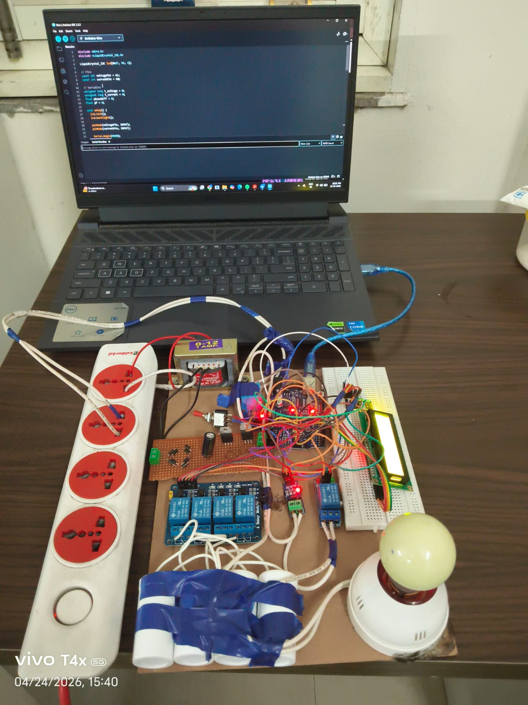
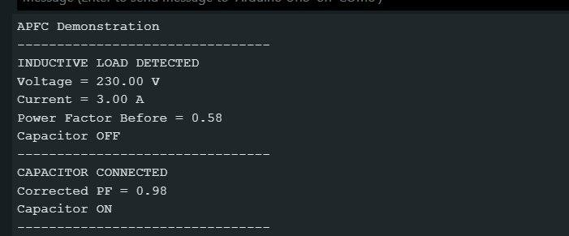

# Automatic Power Factor Correction using Capacitor Bank

## Description
This project is an automatic power factor correction (APFC) system developed using capacitor banks for reactive power compensation. The system improves the power factor of electrical loads by automatically switching capacitor stages according to load conditions.

## Objective
To improve power factor, reduce reactive power losses, and enhance power quality in electrical systems using automatic capacitor bank switching.

## Components Used
- Capacitor Bank: 2.7 µF capacitor
- Step-down Transformer: 240V AC to 12V AC
- Rectifier Circuit: Used to convert 12V AC to DC
- Voltage Regulator / Control Supply: 12V DC to 5V DC
- Relay 
- Electrical Load
- Connecting Wires
- Power Supply

## Working
The 240V AC supply is stepped down to 12V AC using a transformer. This 12V AC is converted into DC using a rectifier circuit and further regulated to 5V DC for the control circuit. The APFC system uses a 2.7 µF capacitor for power factor correction. Based on the load condition, the control circuit switches the capacitor into the circuit to compensate reactive power and improve the power factor.

## Features
- Automatic power factor improvement
- Reactive power compensation
- Capacitor bank switching
- Reduced power losses
- Improved power quality
- Better energy efficiency

## Skills Used
- Power Factor Correction
- Capacitor Bank
- Reactive Power Compensation
- Power System
- Power Quality
- Electrical Wiring
- Relay Control
- Energy Efficiency

## Outcome
The project helped in understanding power factor improvement techniques, capacitor bank operation, reactive power compensation, and practical applications of power quality enhancement in electrical systems.

## Project Images

### Hardware Setup

### Output

